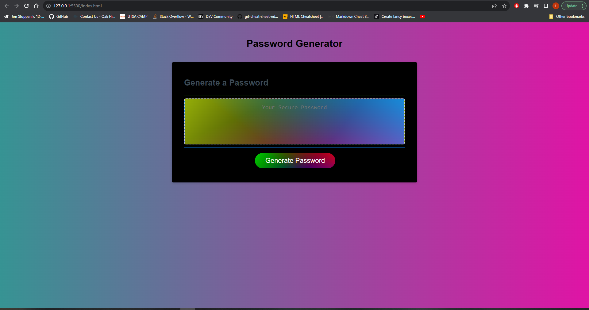

# 03 JavaScript: Password Generator

## Description

Third weeks challenge, creating a random password generator! This showcases my ability to use Javascript, Arrays, If statements, Functions, Variables, Math.Random and more!

## Links

Github Link: https://github.com/codyleight/challenge3-password
Deployed Website : https://codyleight.github.io/challenge3-password/

## Usage

A showcase for a random number generator/ password generator by selecting parts of an array. This array was built based upon what the user wants in their password.
## Credits

Cody Thompson
Repo location on pc: - C:\Users\JC\Desktop\Bootcamp2\challenge3

## Photo Preview of Website
 

